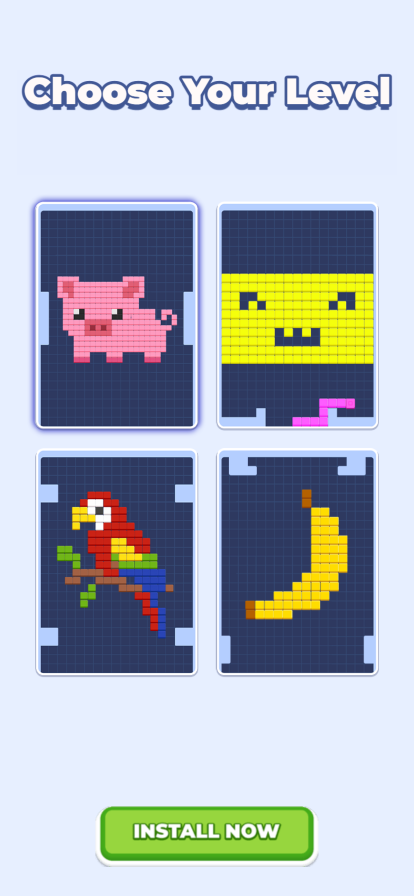
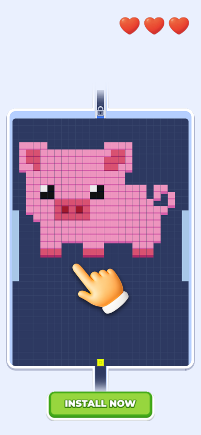
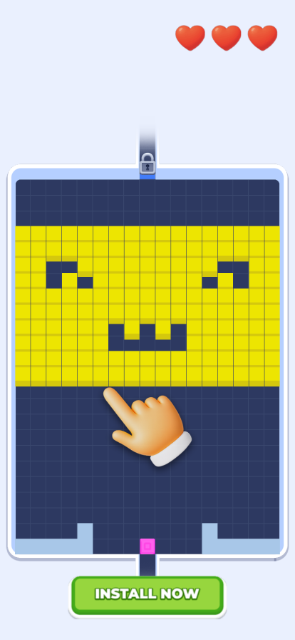
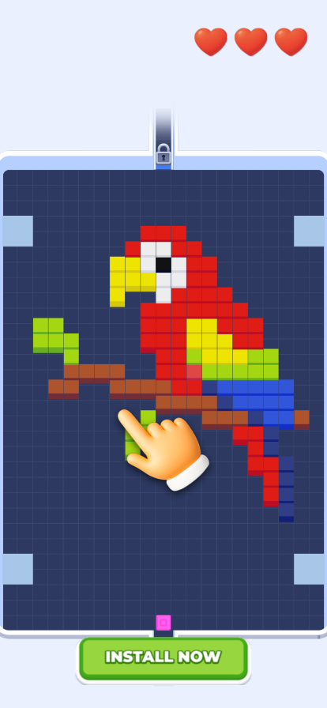
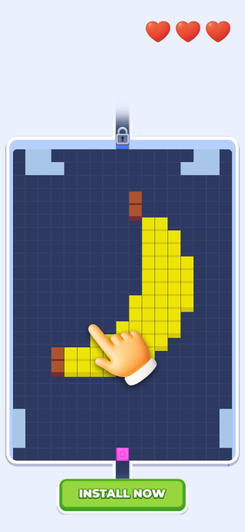
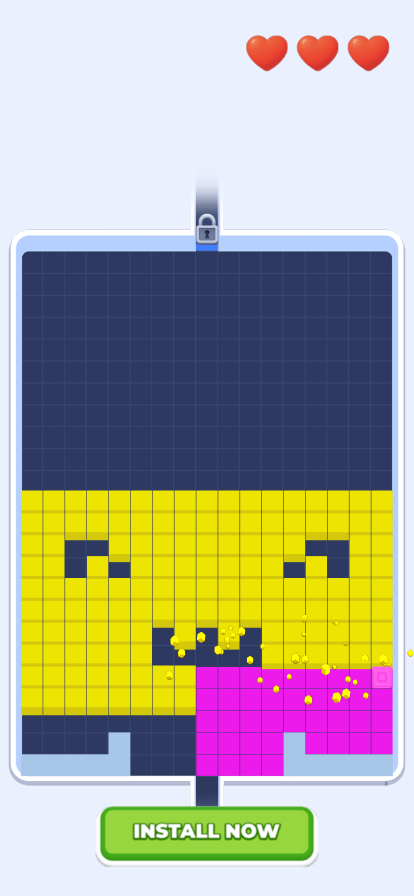
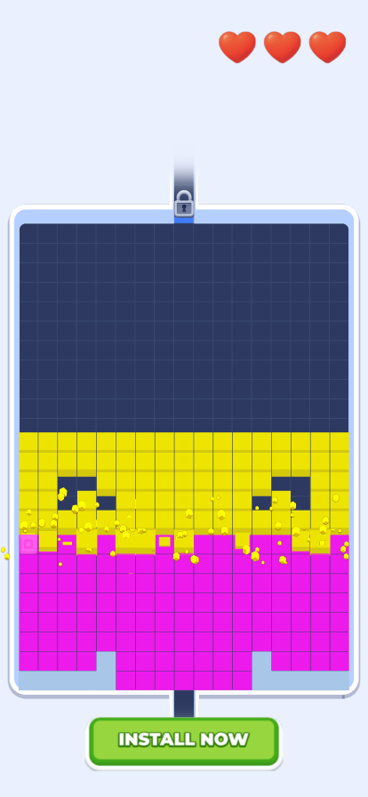
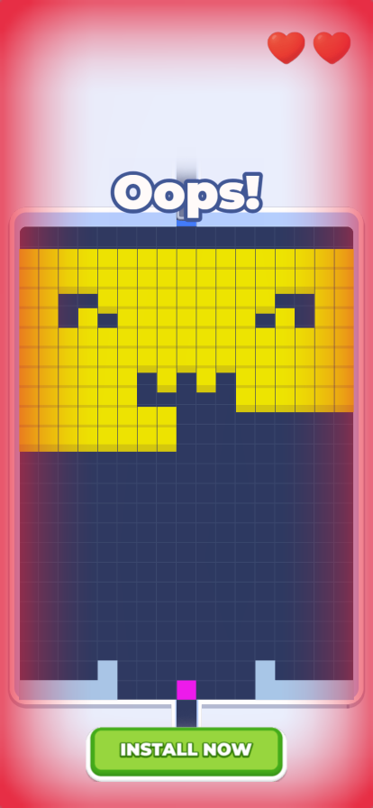
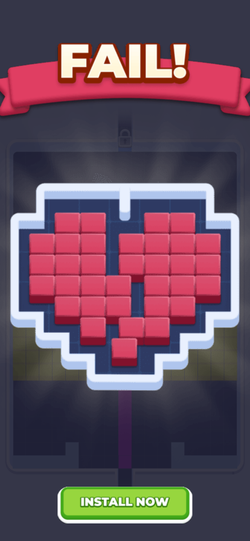
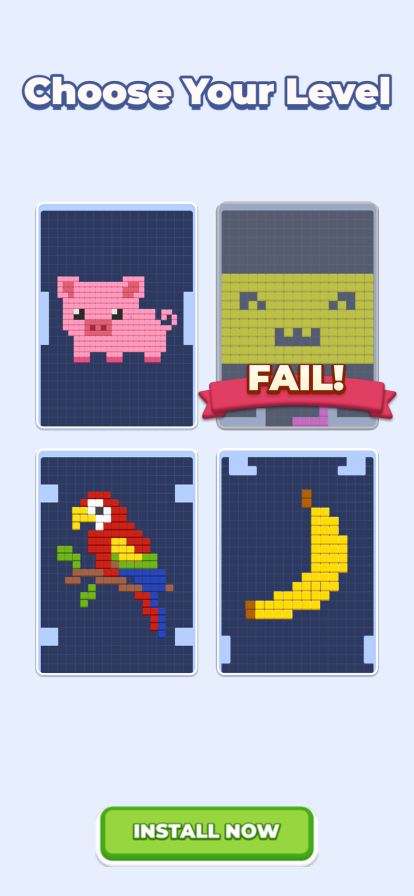

# Cube Slide

Swipe-based cube sliding puzzle game built with Cocos Creator. Swipe to move the cube across a grid, fill cells, collect coins, and destroy enemies across multiple levels.

## Gallery

<table>
<tr>
    <td></td>
    <td></td>
    <td></td>
    <td></td>
</tr>
<tr>
    <td></td>
    <td></td>
    <td></td>
    <td></td>
</tr>
<tr>
    <td></td>
    <td></td>
    <td></td>
    <td></td>
</tr>
</table>

## Tech Stack

- **Engine:** Cocos Creator 3.8.8
- **Language:** TypeScript
- **Platform:** Playable Ad (HTML5)

## Setup

1. Open the project in Cocos Creator 3.8.8
2. Run **Project → Build** to export the playable
3. Open `index.html` or deploy to your playable ad network
